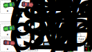

# Explainable Reinforcement Learning via Dynamic Mixture Policies

This is our official implementation of the paper "Explainable Reinforcement Learning via Dynamic Mixture Policies"
presented at ICRA 2025. You may find the draft version [here](http://www.tnt.uni-hannover.de/papers/data/1769/ICRA_2025-4.pdf).
We will link the final version once published by IEEE (or find it in the conference app if you are attending!).


## Abstract

Learning control policies using deep reinforcement learning has shown great success for a variety of applications, including robotics and automated driving. 
A key area limiting the adaptation of RL in the real world is the lack of trust in the decision-making process of such policies. Therefore, explainability is a requirement of any RL agent operating in the real world. 
In this work, we propose a family of control policies that are explainable-by-design regarding individual observation components on object-based scene representations.
By estimating diagonal squashed Gaussian and categorical mixture distributions on sub-spaces of the decomposed observations, we develop stochastic policies with easy-to-read explanations of the decision-making process.
Our design is generally applicable to any RL algorithm using stochastic policies.
We showcase the explainability on an extensive suite of single- and multi-agent simulations, set- and sequence-based high-level scenes, and discrete and continuous action spaces, with performance at least on-par or better compared to standard policy architectures. 
In additional experiments, we analyze the robustness of our approach to its single additional hyper-parameter and examine its potential for very low computational requirements with tiny policies.



## Installation

These instructions use [mamba](https://github.com/mamba-org/mamba) for configuring the python environment.
However, any other package manager should work just fine. Using mamba, please install a suitable environment using:

```shell
mamba create -n xrldmp python=3.10
mamba activate xrldmp
pip install -r requirements.txt
```

## Running experiments

Our code requires a `wandb`-Account for logging. Once you have set up an account, you can repeat experiments from
our paper by running either `main.py` for single-agent scenarios or `marl_main.py` for multi-agent scenarios.

To repeat experiments using the same hyperparameters, the following configuration options are provided.
```shell
python main.py -cn racing_dsac
python main.py -cn racing_sac
python main.py -cn racing_xsac
python main.py -cn racing_xdsac
python main.py -cn tracking_dsac
python main.py -cn tracking_sac
python main.py -cn tracking_xsac
python main.py -cn tracking_xdsac

python marl_main.py -cn marl_intersection_dsac
python marl_main.py -cn marl_intersection_sac
python marl_main.py -cn marl_intersection_xdsac
python marl_main.py -cn marl_intersection_xsac
```

## Citing

Please cite this work as:

```bibtex
@inproceedings { SchSch2025,
  author = {Maximilian Schier and Frederik Schubert and Bodo Rosenhahn},
  title = {Explainable Reinforcement Learning via Dynamic Mixture Policies},
  booktitle = {2025 IEEE International Conference on Robotics and Automation (ICRA)},
  year = {2025},
  pages = {To be published}
}
```

We will update this information once the proceedings appear.
